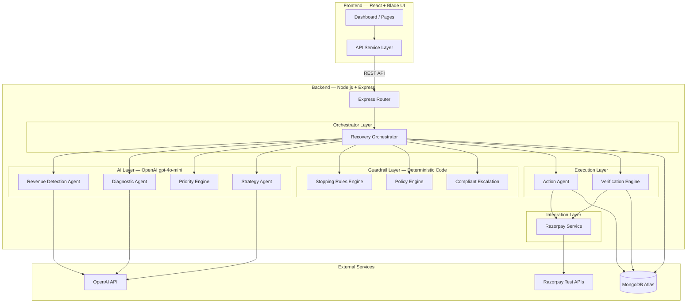
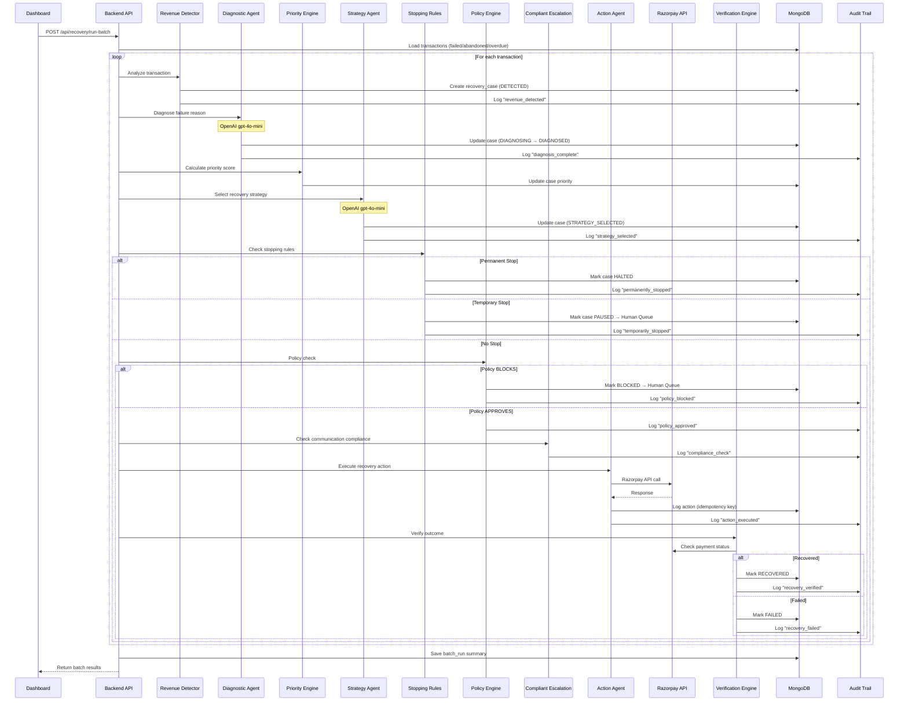
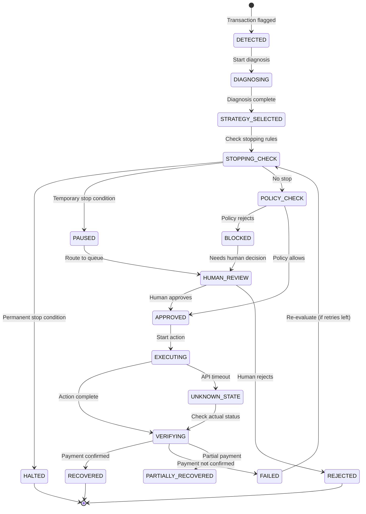
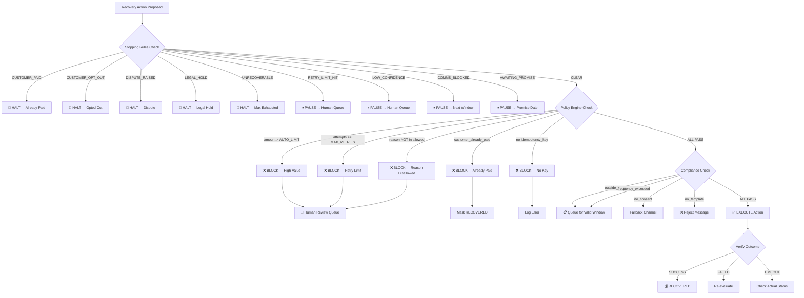
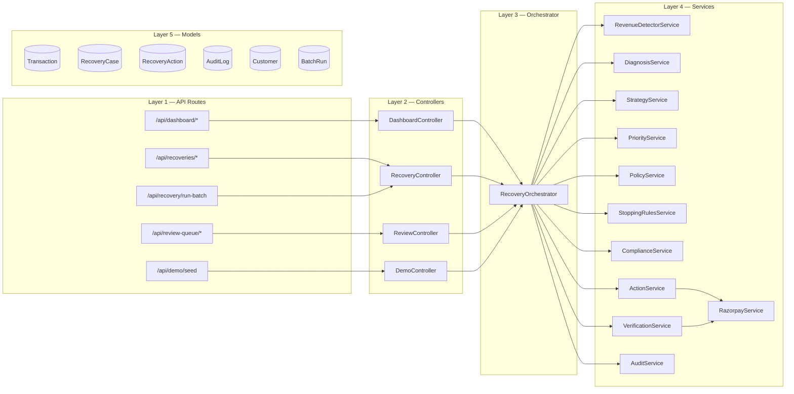

# RazorRecover AI — Complete Implementation Plan

**Product:** RazorRecover AI  
**Track:** Track 03 — AI Revenue Recovery  
**Theme:** Find revenue that is slipping away and win it back.

---

## Resolved Decisions

| Question | Decision |
|:---|:---|
| **LLM Provider** | OpenAI (`gpt-4o-mini`) — key confirmed in `.env` |
| **Razorpay** | Test Mode — keys extracted from MCP config |
| **Database** | MongoDB Atlas — existing cluster, new `razorrecover` database |
| **UI Framework** | Razorpay Blade Design System (v1.26.0 via MCP) |
| **Frontend** | React + Vite |
| **Backend** | Node.js + Express |

---

## 1. Architecture Overview

### 1.1 High-Level System Architecture



### 1.2 Recovery Pipeline — Step-by-Step Data Flow



### 1.3 Recovery Case State Machine



### 1.4 Policy Decision Tree



### 1.5 Backend Layer Architecture



### 1.6 Frontend Page Architecture

```mermaid
graph TB
    subgraph "App Shell — Blade SideNav + TopNav"
        NAV[Navigation]
    end
    
    subgraph "Page 1 — Dashboard"
        D_METRICS["MetricCards Row<br/>Revenue at Risk | Recovered | Rate | Active | Human"]
        D_CHART["Revenue Breakdown Chart<br/>(Recharts + Blade Card)"]
        D_ACTIVITY["Live Agent Activity Panel<br/>(SSE-powered real-time feed)"]
        D_RECENT["Recent Recoveries Table<br/>(Blade Table)"]
        D_CTA["▶ Run Recovery Button<br/>(Blade Button primary)"]
    end
    
    subgraph "Page 2 — Revenue Opportunities"
        T_TABLE["Recovery Cases Table<br/>Customer | Scenario | Amount | Probability | Status"]
        T_FILTER["Filters: Scenario, Status, Priority"]
        T_SORT["Sort by: Expected Value, Amount, Priority"]
    end
    
    subgraph "Page 3 — Recovery Detail"
        RD_HEADER["Case Header + Status Badge"]
        RD_AI["AI Decision Panel<br/>Why at risk? | Why recoverable? | What to do? | Confidence"]
        RD_TIMELINE["Audit Timeline<br/>(Step-by-step decisions)"]
        RD_POLICY["Policy Decision Display"]
    end
    
    subgraph "Page 4 — Human Review"
        HR_QUEUE["Review Queue Cards<br/>Amount | Reason | AI Recommendation"]
        HR_ACTIONS["Approve / Reject Buttons"]
        HR_DETAIL["Expandable Detail View"]
    end
    
    subgraph "Page 5 — Policies"
        P_CONFIG["Configurable Thresholds<br/>MAX_RETRIES | AUTO_LIMIT | CONFIDENCE"]
        P_TEMPLATES["Message Template Library"]
    end

    NAV --> D_METRICS & T_TABLE & RD_HEADER & HR_QUEUE & P_CONFIG
```



---

## 2. Detailed File-by-File Implementation

### Phase A — Skill Files (Context Preservation)

> [!IMPORTANT]
> These skill files ensure **zero context loss** across all future agent tasks. Each encodes a critical domain of the project.

#### [NEW] `.agents/skills/razorrecover-context/SKILL.md`
- Product name, track brief, judging bar (verbatim quotes), 4 MVP scenarios
- One-liner, philosophy, what NOT to build
- "The Bar" checklist mapping (Section 4a)

#### [NEW] `.agents/skills/razorrecover-architecture/SKILL.md`
- All Mermaid diagrams: system flow, state machine, data flow, layers
- Agent responsibilities table
- AI vs deterministic code separation principle
- Recovery pipeline sequence

#### [NEW] `.agents/skills/razorrecover-data-model/SKILL.md`
- All 6 MongoDB collection schemas with field-level docs
- API endpoint contracts (request/response)
- AI output contract (Section 41 schema)
- Idempotency key format

#### [NEW] `.agents/skills/razorrecover-policy-engine/SKILL.md`
- Policy rules (retry limits, amount limits, allowed reasons)
- Stopping rules (permanent + temporary, full list)
- Compliant escalation checklist (7 checks)
- Escalation ladder (5 steps)
- Message template library
- Configurable thresholds

#### [NEW] `.agents/skills/razorrecover-blade-ui/SKILL.md`
- Page layouts with Blade component mapping
- Dashboard visual hierarchy
- Component usage patterns (Box, Card, Table, Badge, etc.)
- Spacing tokens (spacing.0 through spacing.11)
- Responsive breakpoints

#### [NEW] `.agents/skills/razorrecover-demo/SKILL.md`
- Demo timeline (0–120 seconds script)
- 5 demo cases with expected outcomes
- Test case matrix summary (key rows from Section 73)
- What judges should understand in first minute
- Pre-submission checklist (Section 72)

---

### Phase B — Backend

#### [NEW] `backend/package.json`
Dependencies: `express`, `mongoose`, `cors`, `dotenv`, `openai`, `razorpay`, `uuid`, `morgan`

#### [NEW] `backend/src/server.js`
Express app setup, MongoDB connection, route mounting, error handling

---

#### Models (Mongoose Schemas)

#### [NEW] `backend/src/models/Transaction.js`
```
{ paymentId, customerId, merchantId, amount, currency, method,
  status, failureReason, scenario, checkoutEvents, subscriptionId,
  invoiceId, dueDate, createdAt, updatedAt }
```

#### [NEW] `backend/src/models/RecoveryCase.js`
```
{ transactionId, scenario, amountAtRisk, recoveryProbability,
  priorityScore, diagnosis, recommendedAction, status (state machine),
  batchId, stoppingRule, policyDecision, recoveredAmount, createdAt }
```

#### [NEW] `backend/src/models/RecoveryAction.js`
```
{ recoveryCaseId, action, attempt, policyDecision, complianceCheck,
  idempotencyKey, executedAt, result, razorpayResponse, error }
```

#### [NEW] `backend/src/models/AuditLog.js`
```
{ recoveryCaseId, batchId, event, actor (AI/policy/human/system),
  message, metadata, timestamp }
— Append-only (no update/delete operations)
```

#### [NEW] `backend/src/models/Customer.js`
```
{ customerId, name, email, phone, successfulPayments, totalSpend,
  lastPaymentAt, riskLevel, optedOut, consentChannels }
```

#### [NEW] `backend/src/models/BatchRun.js`
```
{ batchId, startedAt, completedAt, casesScanned, totalRevenueAtRisk,
  recoverableCases, autoActioned, humanReviewRequired,
  blockedByPolicy, stoppedByRules, verifiedRecoveredAmount,
  pendingAmount, recoveryRatePercent, status }
```

---

#### Services (Business Logic)

#### [NEW] `backend/src/services/revenue-detector.service.js`
- Scans transactions for failed payments, abandoned checkouts, failed subscriptions, overdue invoices
- Creates recovery cases with calculated `revenue_at_risk`
- Deduplication by paymentId

#### [NEW] `backend/src/services/diagnosis.service.js`
- Calls OpenAI gpt-4o-mini with transaction context
- Returns structured JSON: `{ category, confidence, recoverability, suggestedAction, reasoning }`
- Validates against output contract, falls back to human review on parse error

#### [NEW] `backend/src/services/strategy.service.js`
- Calls OpenAI with diagnosis + customer history
- Returns: `{ action, priority, expectedRecovery, reasoning }`
- Maps to allowed actions: `retry_payment | generate_link | send_reminder | update_method | escalate_human | stop_recovery`

#### [NEW] `backend/src/services/priority.service.js`
- Calculates `expectedRecovery = amount × probability`
- Factors: customer value, urgency, attempt count, action cost
- Returns sorted ranking

#### [NEW] `backend/src/services/stopping-rules.service.js`
- **Permanent stops**: CUSTOMER_PAID, CUSTOMER_OPT_OUT, DISPUTE_RAISED, LEGAL_HOLD, UNRECOVERABLE
- **Temporary stops**: RETRY_LIMIT_HIT, LOW_CONFIDENCE, POLICY_BLOCKED, COMMS_BLOCKED, AWAITING_PROMISE, IDEMPOTENCY_CONFLICT
- Checked BEFORE policy engine

#### [NEW] `backend/src/services/policy.service.js`
- Deterministic rules (no AI):
  - `attempt_count < MAX_RETRIES`
  - `amount <= AUTO_ACTION_LIMIT`
  - `reason IN allowed_retry_reasons`
  - `customer_not_already_paid`
  - `idempotency_key present`
- Fail-closed: any error = BLOCK

#### [NEW] `backend/src/services/compliance.service.js`
- Contact window check (09:00–19:00 IST)
- Frequency cap (1 msg/24h, 3 total per case)
- Channel consent check
- Template-only messaging (no ad-hoc LLM text)
- DO_NOT_CONTACT flag

#### [NEW] `backend/src/services/action.service.js`
- Executes approved actions via Razorpay service
- Idempotency key generation: `recovery_{caseId}_attempt_{N}`
- Never decides permission (that's policy engine's job)

#### [NEW] `backend/src/services/verification.service.js`
- Checks actual payment status post-action
- Handles: SUCCESS → RECOVERED, FAILED → re-evaluate, TIMEOUT → check again
- Detects partial payments, overpayments

#### [NEW] `backend/src/services/razorpay.service.js`
- Wraps Razorpay SDK (test mode)
- Methods: `createOrder`, `retryPayment`, `createPaymentLink`, `fetchPayment`, `fetchOrder`
- All calls logged

#### [NEW] `backend/src/services/audit.service.js`
- Append-only logging to `audit_logs` collection
- Every state transition gets: timestamp, actor, event, metadata
- Export to CSV/JSON for judges

#### [NEW] `backend/src/services/orchestrator.service.js`
- Master pipeline: detect → diagnose → prioritize → strategize → stop check → policy → comply → act → verify
- Batch processing with progress tracking
- Resumable (tracks last committed case)

---

#### Controllers & Routes

#### [NEW] `backend/src/controllers/dashboard.controller.js`
- `GET /api/dashboard/summary` — top metrics (at risk, recovered, rate, active, reviews)
- `GET /api/dashboard/breakdown` — revenue by scenario type

#### [NEW] `backend/src/controllers/recovery.controller.js`
- `GET /api/recoveries` — list all recovery cases
- `GET /api/recoveries/:id` — case detail with audit trail
- `POST /api/recovery/run-batch` — trigger batch recovery run
- `GET /api/recovery/batch/:batchId` — batch results + export

#### [NEW] `backend/src/controllers/review.controller.js`
- `GET /api/review-queue` — human review cases
- `POST /api/review-queue/:id/approve` — approve case
- `POST /api/review-queue/:id/reject` — reject case

#### [NEW] `backend/src/controllers/demo.controller.js`
- `POST /api/demo/seed` — load 500+ synthetic transactions
- `POST /api/demo/reset` — clear and re-seed

#### [NEW] `backend/src/routes/*.routes.js`
- Route files mounting controllers

#### [NEW] `backend/src/utils/logger.js`
- Structured logging with timestamps

#### [NEW] `backend/src/utils/idempotency.js`
- Key generation + duplicate check

#### [NEW] `backend/src/data/seed-data.js`
- 500+ synthetic transactions: 300 successful, 70 payment failures, 50 checkout abandonments, 35 subscription failures, 25 overdue invoices, 20 edge cases

---

### Phase C — Frontend (React + Vite + Blade)

#### [NEW] `frontend/` — scaffolded with `npx create-vite`
Install: `@razorpay/blade`, `react-router-dom`, `recharts`, `axios`

#### [NEW] `frontend/src/App.jsx`
- Blade `BladeProvider` wrapping
- React Router with SideNav layout

#### [NEW] `frontend/src/pages/Dashboard.jsx`
- **MetricCards row**: Revenue at Risk, Recovered, Recovery Rate, Active, Human Reviews
- **Revenue breakdown chart** (Recharts bar chart in Blade Card)
- **Live Agent Activity** panel (polling/SSE for real-time updates)
- **Recent recoveries** table
- **"▶ Run Recovery"** button (Blade Button, primary)

#### [NEW] `frontend/src/pages/Recoveries.jsx`
- Blade Table with columns: Customer, Scenario, Amount, Probability, Priority, Action, Status
- Filters by scenario type, status
- Click row → Recovery Detail

#### [NEW] `frontend/src/pages/RecoveryDetail.jsx`
- Case header with Blade Badge for status
- **AI Decision Panel**: Why at risk? Why recoverable? What to do? Confidence score
- **Audit Timeline**: step-by-step decision history with timestamps
- Policy decision display

#### [NEW] `frontend/src/pages/ReviewQueue.jsx`
- Cards for each case needing human review
- Amount, blocking reason, AI recommendation
- Approve / Reject buttons (Blade Button)

#### [NEW] `frontend/src/pages/Policies.jsx`
- Editable thresholds: MAX_RETRIES, AUTO_ACTION_LIMIT, MIN_CONFIDENCE
- Message template viewer

#### [NEW] `frontend/src/components/MetricCard.jsx`
- Blade Card with large number + label + trend indicator

#### [NEW] `frontend/src/components/AgentActivity.jsx`
- Live feed showing each agent step with status icons

#### [NEW] `frontend/src/components/AuditTimeline.jsx`
- Vertical timeline of case decisions

#### [NEW] `frontend/src/components/RevenueChart.jsx`
- Recharts breakdown chart wrapped in Blade Card

#### [NEW] `frontend/src/services/api.js`
- Axios instance with base URL from env
- Methods for all endpoints

---

## 3. Build Order

| Phase | What | Files | Priority |
|:---|:---|:---|:---|
| **A** | Skill files (6 files) | `.agents/skills/*/SKILL.md` | 🔴 First — context preservation |
| **B1** | Backend models + seed data | `models/*.js`, `seed-data.js` | 🔴 Foundation |
| **B2** | Core services (detector, diagnosis, strategy, policy, stopping, compliance) | `services/*.service.js` | 🔴 Core pipeline |
| **B3** | Orchestrator + action + verification | `orchestrator.service.js`, `action.service.js`, `verification.service.js` | 🔴 Pipeline glue |
| **B4** | Controllers + routes + server | `controllers/*.js`, `routes/*.js`, `server.js` | 🟡 API layer |
| **C1** | Frontend setup + App shell + Dashboard | `App.jsx`, `Dashboard.jsx`, components | 🟡 Demo impact |
| **C2** | Remaining pages (Recoveries, Detail, Review, Policies) | Pages + components | 🟢 Full experience |
| **D** | Integration testing + demo polish | Test runs, edge cases | 🟢 Final polish |

---

## 4. Verification Plan

### Automated Tests
```bash
# Policy engine — all 10 rules
npm run test -- --grep "policy"

# Stopping rules — 8 conditions
npm run test -- --grep "stopping"

# Idempotency — duplicate prevention
npm run test -- --grep "idempotency"

# Batch — resumability, deduplication
npm run test -- --grep "batch"
```

### Manual Demo Verification
- [ ] Dashboard shows ₹8.42L at risk before run
- [ ] "Run Recovery" processes 73 cases with live activity
- [ ] Dashboard updates to ₹2.17L recovered after run
- [ ] Click a recovered case → full audit trail visible
- [ ] Click a blocked case → exact rule shown in plain English
- [ ] Human review queue shows 9 cases with approve/reject
- [ ] Export batch results as CSV/JSON
- [ ] Demo runs end-to-end under 2 minutes

---

## Open Questions

> [!IMPORTANT]
> **Blade Installation**: Should we use `@razorpay/blade` from npm, or do you have a preference for a specific version / internal package?

> [!NOTE]
> The Razorpay keys in `.env` were extracted from your MCP server config (test mode keys). These will be used for the Razorpay Service layer. Let me know if you want different keys.

---

**Ready to proceed?** On approval, I will start with Phase A (skill files) followed by Phase B1 (backend models + seed data).
